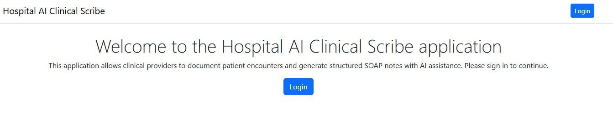

# Hospital-AI — Clinical Scribe

An AI-assisted clinical documentation platform for healthcare providers. Hospital-AI helps
providers turn patient encounter transcripts into structured SOAP notes using generative AI,
while giving admins tools to manage providers, note templates, and oversee encounters across
the organization.

> Built as a demonstration/challenge project showcasing an end-to-end ASP.NET Core Razor Pages
> application backed by Azure OpenAI, Entity Framework Core, and Entra External ID (CIAM)
> authentication.


Link to live site: https://app-hospital-prod-axarfzabe9b5a7av.westcentralus-01.azurewebsites.net/

[](https://app-hospital-prod-axarfzabe9b5a7av.westcentralus-01.azurewebsites.net/)

## Table of Contents

- [Features](#features)
- [Architecture](#architecture)
- [Tech Stack](#tech-stack)
- [Project Structure](#project-structure)
- [Getting Started](#getting-started)
  - [Prerequisites](#prerequisites)
  - [Configuration](#configuration)
  - [Database Setup](#database-setup)
  - [Running the App](#running-the-app)
- [Deployment (Azure)](#deployment-azure)
- [Roles & Access](#roles--access)
- [Contributing](#contributing)
- [License](#license)

## Features

- **AI-generated SOAP notes** — Streams a Subjective/Objective/Assessment/Plan note from a raw
  encounter transcript using an Azure OpenAI chat model, with tool-calling into prior patient
  history for context.
- **Encounter workspace** — Providers can start encounters, autosave transcripts/drafts as they
  type (with cross-device/session persistence), and generate notes on demand.
- **Note version history** — Every saved note is kept as an immutable version, viewable and
  attributable to the provider and timestamp that saved it.
- **Side-by-side version diff** — Compare any two saved note versions with a line-level
  added/removed/unchanged diff (LCS-based) per SOAP section.
- **ICD-10 code search** — In-app, explainable relevance-ranked search over ~220 curated
  ICD-10-CM codes for quick insertion into the Assessment section.
- **Note templates** — Admins can define reusable prompt templates (e.g. by encounter type)
  that are injected into the AI system prompt live, without requiring a redeploy.
- **Admin dashboard** — Provider roster management (add/deactivate/reactivate, with a
  self-deactivation guard), an all-encounters view filterable by provider/date, and template
  management.
- **Authentication & authorization** — Sign-in via Microsoft Entra External ID (CIAM); every
  page requires authentication by default, with role checks (Provider/Admin) enforced
  per-page.
- **Audit logging** — Key actions are recorded via an `AuditLog` model for traceability.

## Architecture

Hospital-AI is a single ASP.NET Core 10 Razor Pages application (with a handful of thin API
controllers for AJAX/streaming endpoints) following a straightforward layered structure:

```
Pages/           Razor Pages (UI) - Encounters, Admin, Index, AccessDenied
Controllers/     API controllers (ICD-10 search, streaming note generation via SSE)
Services/        Business logic behind interfaces (I*Service), registered as scoped in DI
Models/          EF Core entities (Patient, Encounter, NoteVersion, Provider, etc.)
Data/            DbContext, EF Core migrations, and demo data seeding
Settings/        Strongly-typed configuration (AISettings)
```

**Request flow:** Razor Page handler → Service (interface) → `ClinicalScribeDbContext` (EF
Core) → Azure SQL Database. Note generation additionally streams tokens from Azure OpenAI to
the browser via Server-Sent Events (`Controllers/NoteGenerationController.cs`).

**Authentication:** `Program.cs` configures cookie + OpenID Connect authentication against
Microsoft Entra External ID via `Microsoft.Identity.Web`. A fallback authorization policy
requires sign-in on every page/controller unless explicitly marked `[AllowAnonymous]`.
`RoleResolutionService` maps the signed-in user's email to a `Provider` record (and its
`ProviderRole`); deactivated or unmatched accounts are redirected to `/AccessDenied`.

**Database:** EF Core migrations manage the Azure SQL schema. On startup, `Program.cs` applies
pending migrations and seeds demo provider accounts and the ICD-10 code table
(`Data/DbSeeder.cs`), idempotently.

**AI integration:** `AISettings` (bound from configuration) supplies the Azure OpenAI endpoint,
API key, and deployment/model name. `NoteGenerationService` builds a system prompt (optionally
augmented by an encounter's assigned `NoteTemplate`) and streams the model's response back to
the client.

Companion projects in this repo (not required to run the main app):

- **Hospital-AIAzureFunctions** — a supporting Azure Function app (see its own folder).
- **Hospital-AIChat** — a console client for interacting with note/attachment APIs.
- **bicep/** — Infrastructure-as-code templates for provisioning the Azure resources (App
  Service, storage, etc.) used to host this application.

## Tech Stack

| Layer            | Technology                                                   |
|-------------------|--------------------------------------------------------------|
| Framework         | ASP.NET Core 10 (Razor Pages + minimal API controllers)      |
| Language          | C# / .NET 10                                                 |
| Database          | Azure SQL Database via Entity Framework Core 10               |
| AI                | Azure OpenAI (`Azure.AI.OpenAI`, `Microsoft.Extensions.AI`)   |
| Authentication    | Microsoft Entra External ID (CIAM) via `Microsoft.Identity.Web` |
| API docs          | Swashbuckle / OpenAPI                                        |
| Infrastructure    | Bicep (Azure App Service, SQL, managed identity)              |

## Project Structure

```
Hospital-AI/                 Main Razor Pages web application
  Pages/                     Razor Pages (Encounters, Admin, Index, AccessDenied, etc.)
  Controllers/               API controllers (ICD-10 search, note generation streaming)
  Services/                  Business/domain logic
  Models/                    EF Core entity classes
  Data/                      DbContext, migrations, seed data
  Settings/                  Configuration POCOs
  wwwroot/                   Static assets
Hospital-AIAzureFunctions/   Companion Azure Functions app
Hospital-AIChat/             Console client sample
bicep/                       Azure infrastructure-as-code templates
Hospital-AI.slnx             Visual Studio solution
```

## Getting Started

### Prerequisites

- [.NET 10 SDK](https://dotnet.microsoft.com/download)
- [Visual Studio 2026](https://visualstudio.microsoft.com/) (or VS Code) with ASP.NET/Razor
  workload
- An Azure SQL Database (or local SQL Server/LocalDB for development)
- An Azure OpenAI resource with a chat-completion model deployed
- A Microsoft Entra External ID (CIAM) tenant configured for sign-in

### Configuration

The app reads configuration from `appsettings.json` / `appsettings.Development.json` plus
[.NET user secrets](https://learn.microsoft.com/aspnet/core/security/app-secrets) for local
development. **Do not commit real secrets** — `ApiKey`, connection strings, and tenant IDs
should be supplied via user secrets or environment variables locally, and via app settings /
managed identity in Azure.

Required settings:

```jsonc
{
  "AISettings": {
    "DeploymentUri": "https://<your-openai-resource>.openai.azure.com/",
    "ApiKey": "<your Azure OpenAI key>",
    "DeploymentModelName": "<your deployed model name>"
  },
  "ConnectionStrings": {
    "DefaultConnection": "<your SQL connection string>"
  },
  "AzureAd": {
    "Instance": "https://<your-tenant>.ciamlogin.com/",
    "TenantId": "<tenant id>",
    "ClientId": "<app registration client id>",
    "CallbackPath": "/signin-oidc",
    "SignedOutCallbackPath": "/signout-callback-oidc"
  }
}
```

Set secrets locally with the Secret Manager, for example:

```powershell
cd Hospital-AI
dotnet user-secrets set "AISettings:ApiKey" "<your-key>"
dotnet user-secrets set "ConnectionStrings:DefaultConnection" "<your-connection-string>"
```

### Database Setup

Migrations are applied automatically at startup (`app.Database.MigrateAsync()` in
`Program.cs`), and demo provider accounts plus the ICD-10 code table are seeded idempotently.
No manual migration step is required for local development — just make sure the connection
string points at a reachable SQL Server/Azure SQL instance.

To create a new migration after model changes:

```powershell
cd Hospital-AI
dotnet ef migrations add <MigrationName>
```

### Running the App

```powershell
cd Hospital-AI
dotnet restore
dotnet run
```

Or open `Hospital-AI.slnx` in Visual Studio 2026 and press **F5**.

The app will apply migrations/seed data, then be available at the URL shown in the console
(see `Properties/launchSettings.json`). Swagger UI is available at `/swagger` for the API
controllers.

## Deployment (Azure)

Infrastructure templates live in [`bicep/`](./bicep):

- `main.bicep` — top-level deployment entry point
- `storage-and-appservice.bicep` — App Service + storage resources
- `move-storage-and-appservice.bicep` / `upgrade-appservice-plan.bicep` — supporting
  infra changes

The app is designed to run on Azure App Service (Linux) with a user-assigned managed identity
for SQL authentication (`DB_IDENTITY_CLIENT_ID`) when not running in Development. Ensure both
`appsettings.json` and any environment-specific settings files are kept in sync when changing
Azure resource endpoints, since App Service defaults to the Production environment.

## Roles & Access

| Role     | Capabilities                                                                 |
|----------|-------------------------------------------------------------------------------|
| Provider | Start/manage encounters, generate and edit notes, view/compare note versions |
| Admin    | Everything a Provider can do, plus: manage provider roster, manage note templates, view all encounters across providers |

Unauthenticated or deactivated accounts are redirected to `/AccessDenied`.

## Contributing

1. Fork the repo and create a feature branch.
2. Make your changes, keeping services behind interfaces and adding EF Core migrations for
   any schema changes.
3. Ensure `dotnet build` succeeds and existing tests pass.
4. Open a pull request describing the change.

## License

This project is licensed under the [MIT License](./LICENSE).
